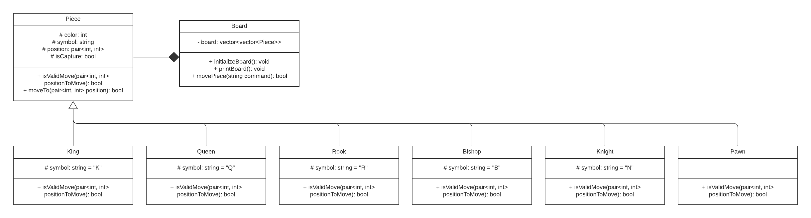

# Console Chess

Este repositorio contiene el diagrama UML del proyecto "Console Chess", un videojuego de ajedrez programado en C++ para ser jugado en la consola.

## UML Diagrama de Clases

El diagrama UML representa la estructura de clases del proyecto, mostrando las relaciones de herencia y composición entre las diferentes clases.

## Avances

### Creación de las clases

Se han creado las clases principales del proyecto, con sus respectivos atributos y métodos. Se han definido las relaciones de herencia y composición entre las clases.
