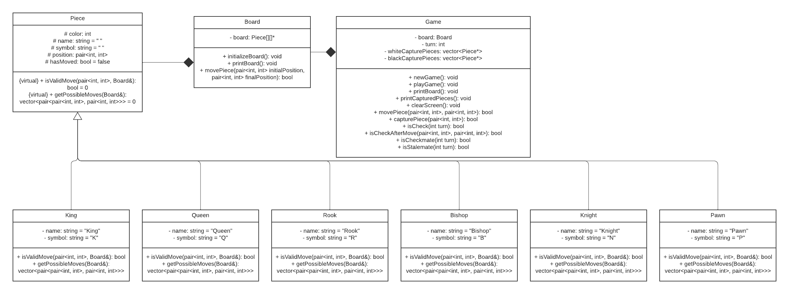

# Console Chess ♟️

Este repositorio contiene el diagrama UML del proyecto "Console Chess", un videojuego de ajedrez programado en C++ para ser jugado en la consola.

## UML Diagrama de Clases

El diagrama UML representa la estructura de clases del proyecto, mostrando las relaciones de herencia y composición entre las diferentes clases.

## Avances

### Creación de las clases

Se han creado las clases principales del proyecto, con sus respectivos atributos y métodos. Se han definido las relaciones de herencia y composición entre las clases.

La declaración e implementación de las clases están en archivos distintos debido a que ocurrían errores dado a que existía una dependencia circular entre las clases `Piece` y `Board`.

### Implementación de polimorfismo

Se ha implementado el polimorfismo en las clases `Piece` y `Board`, de tal manera que `Board` tenga un atributo de tipo `Piece` y pueda acceder a los métodos de las clases hijas de `Piece` (por ejemplo, `Piece::move()`).
